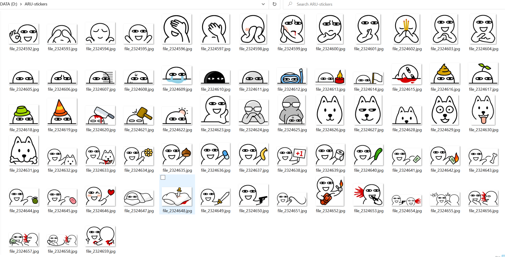
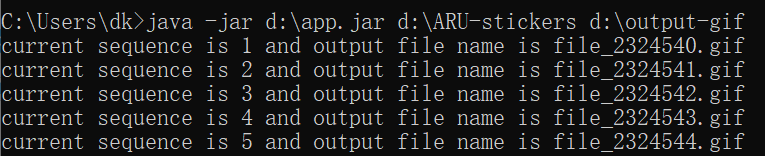
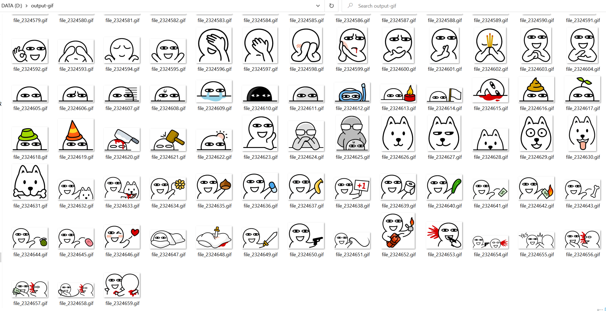
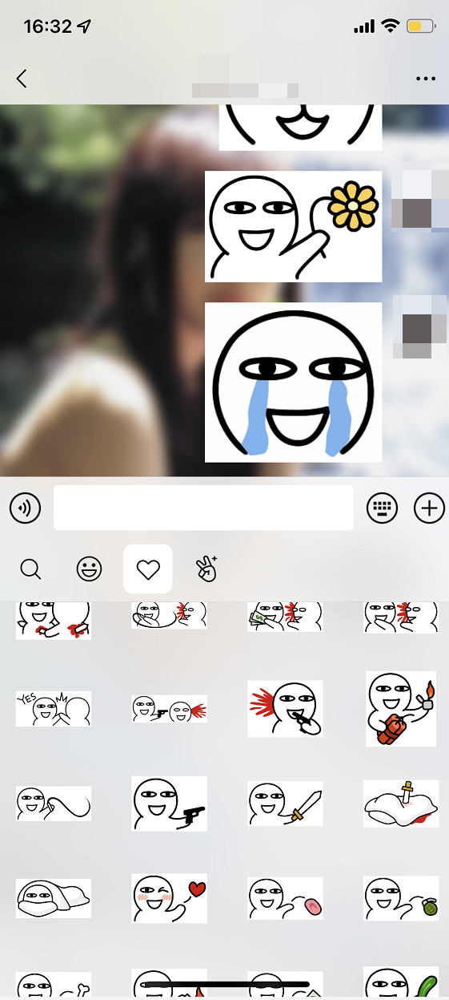

> **前言**  
> 试用了好几个在线 jpg 转 gif 的网站，要么不免费，要么免费但并行转换的数量只有 2 个，需要注册提升并行转换数量等等，还有的甚至不能批量转换。遂根据我自己的需求（也比较简单）写了这个工具。

# jpg2gif

  

- 把 telegram 导出的 jpg/jpeg/png 静态表情图片转换成微信能够导入的 `.gif` 文件
- 输入一个文件夹路径，转换该文件夹下的所有 sticker 图片（不会递归查询子文件夹）
- 输出一个文件夹路径，保存所有的 `.gif` 文件，可以全选拖动到微信聊天页，然后发送，等发送成功就能「Add Sticker」
- [release v1.1](https://github.com/hellodk34/jpg2gif/releases/tag/v1.1) 支持保存透明背景的 gif 表情，请使用 png 图片作为图片源，欢迎测试，有问题请创建 issue

## 如何获取 telegram 表情 archive 档案？

使用 tg bot 获取表情的 `.zip` 压缩包。以下两个 bot 都可以

- `@stickerset2packbot`
- `@Stickerdownloadbot` (**更加推荐**)

本项目适用于静态图片的表情，动态图片的表情建议使用 bot [@tgstogifbot](https://github.com/ed-asriyan/tgs-to-gif)。

## 用法

本项目使用非常简单，下载 jar 包执行以下命令，然后就能在输出文件夹得到所有 `.gif` 图片

```
java -jar app.jar IMG_FOLDER OUTPUT_FOLDER
```

下面是拿表情包 [ARU_full](https://t.me/addstickers/ARU_full) 举例





转换完成后可以发送文件到微信再逐一 **Add Sticker**，然后就可以使用微信发这些表情包了。看下图


